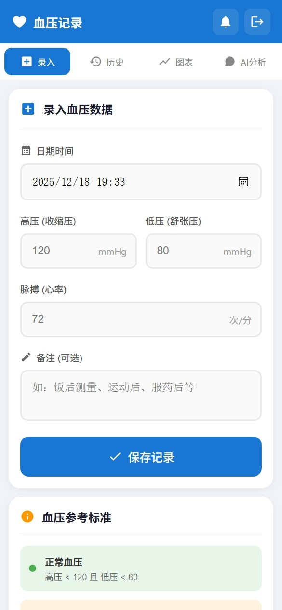
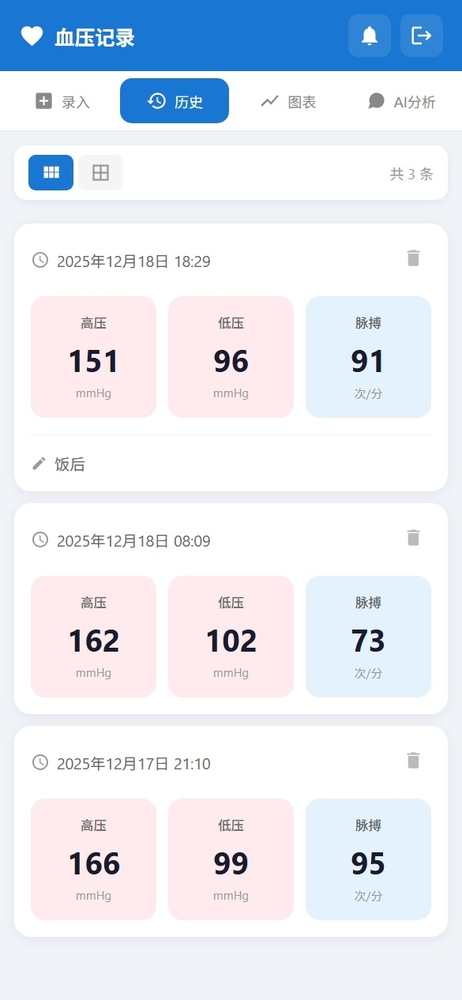
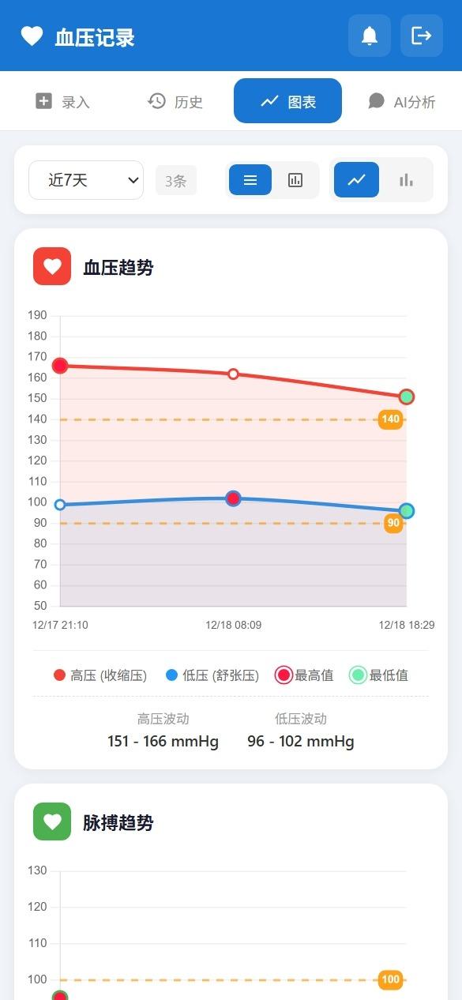
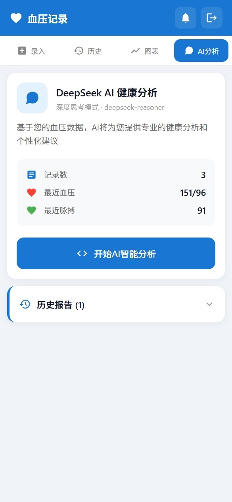

# 血压记录助手 (Blood Pressure Tracker)
一个基于 Vue 3 + Vite 的血压记录和健康管理应用，支持数据可视化、AI 智能分析和微信推送提醒。

## 技术栈

- **前端**: Vue 3 + Vite + Chart.js
- **后端**: Node.js + Express
- **数据库**: SQLite (sql.js)
- **AI**: DeepSeek API

## 快速开始

### 环境要求

- Node.js >= 16
- npm 或 yarn

### 安装

```bash
# 克隆项目
git clone https://github.com/68057022/blood-pressure-tracker.git
cd blood-pressure-tracker

# 安装前端依赖
npm install

# 安装后端依赖
cd server
npm install
cd ..
```

### 配置

1. 复制环境变量示例文件：

```bash
cp .env.example .env
cp server/.env.example server/.env
```

2. 编辑 `.env` 和 `server/.env`，填入你的配置：

```env
# server/.env
DEEPSEEK_API_KEY=your_deepseek_api_key
SERVER_CHAN_KEY=your_server_chan_key
```

3. 修改登录密码（可选）：

编辑 `src/components/LoginPage.vue`，修改 `CORRECT_PASSWORD` 的值。

### 运行

**开发模式：**

```bash
# 启动后端服务
cd server
node index.js

# 新终端，启动前端
npm run dev
```

**生产部署：**

```bash
# 构建前端
npm run build

# 启动服务（会同时提供静态文件和 API）
cd server
node index.js
# 或使用 PM2
pm2 start index.js --name bp-tracker
```

### Nginx 配置示例

```nginx
server {
    listen 80;
    server_name your-domain.com;
    
    location / {
        proxy_pass http://127.0.0.1:3001;
        proxy_set_header Host $host;
        proxy_set_header X-Real-IP $remote_addr;
    }
}
```

## 项目结构

```
blood-pressure-tracker/
├── src/
│   ├── components/
│   │   ├── LoginPage.vue      # 登录页
│   │   ├── MainApp.vue        # 主应用
│   │   ├── RecordForm.vue     # 录入表单
│   │   ├── HistoryList.vue    # 历史记录
│   │   ├── ChartView.vue      # 图表展示
│   │   └── AIAnalysis.vue     # AI 分析
│   ├── api.js                 # API 封装
│   ├── App.vue
│   └── main.js
├── server/
│   ├── index.js               # 后端服务
│   └── package.json
├── public/
└── package.json
```

## API 接口

| 方法 | 路径 | 说明 |
|------|------|------|
| GET | /api/records | 获取所有血压记录 |
| POST | /api/records | 添加血压记录 |
| DELETE | /api/records/:id | 删除血压记录 |
| GET | /api/reports | 获取 AI 分析报告 |
| POST | /api/reports | 保存 AI 分析报告 |
| DELETE | /api/reports/:id | 删除 AI 分析报告 |
| POST | /api/push | 发送推送通知 |

## 截图

| 录入 | 历史 | 图表 | AI分析 |
|:---:|:---:|:---:|:---:|
|  |  |  |  |

## 许可证

MIT License

## 致谢

- [DeepSeek](https://deepseek.com/) - AI 分析能力
- [Server酱](https://sct.ftqq.com/) - 微信推送服务
- [Chart.js](https://www.chartjs.org/) - 图表库

---

© 2025 往事随风烟消云散
